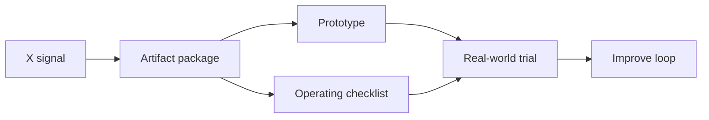

# Cloudflare Grok Provider Router Kit Infographic

## Core idea
Cloudflare AI Gateway makes multimodal provider routing feel like product infrastructure instead of one-off API plumbing.

## Before / after
- Before: scattered tweet saved as passive inspiration.
- After: GitHub-visible artifact with a prototype, loop, and next test.

## How Vinay can use it
1. Open the prototype.
2. Fill the workflow-specific fields.
3. Copy the generated handoff into a repo issue, agent task, or product brief.
